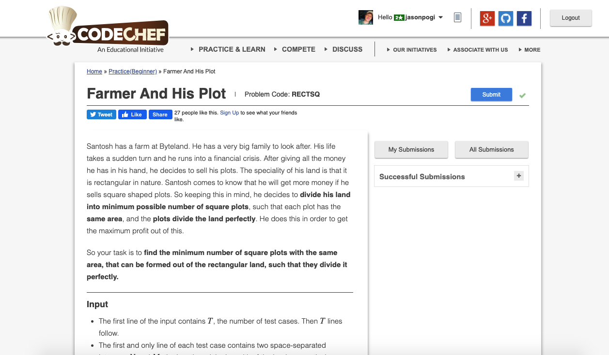

# Codechef-Farmer-and-His-Plot
### Problem

### Program Simulation
<pre>
  Sample Input : 10 15
  l = 10, b = 15

  if l < b // omitted
  else
  x = b
  x = 15
  y = l
  y = 10

  tmp = 0

  *first loop
  while 15 % 10 > 0 // not omitted
  tmp = 15 % 10 // 5
  tmp = 5
  x = 10
  y = 5

  *second loop
  while 10 % 5 > 0 // omitted

  ans = (10 * 150) / ( 5 * 5) = 150 / 25 = 6
  ans = 6

  print ans

  Final Output:
  6
</pre>
